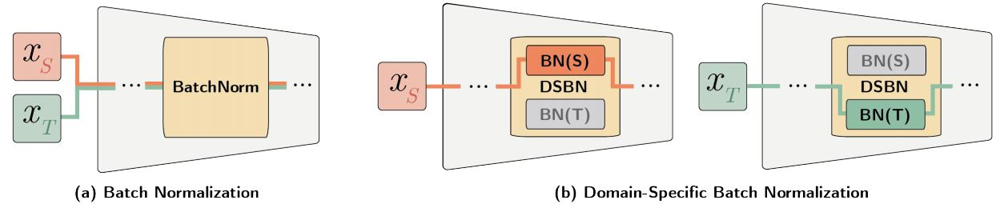
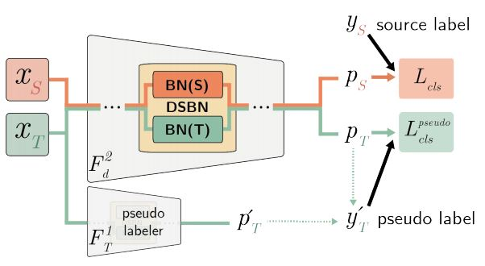

# Domain-Specific Batch Normalization for Unsupervised Domain Adaptation (DSBN)
Pytorch implementation of Domain-Specific Batch Normalization for Unsupervised Domain Adaptation (CVPR2019).


Woong-Gi Chang, Tackgeun You, Seonguk Seo, Suha Kwak, Bohyung Han
The first author name has changed from Woong-Gi Chang to Woojae Chang.

## Citation
If you want to cite our work, follow the link [arXiv](https://arxiv.org/abs/1906.03950). 


## Installation
We recommand to create conda virtualenv nameded pytorch-py36
```bash
conda create -n pytorch-py36 python=3.6 
source activate pytorch-py36
```

* Install [PyTorch 1.3](http://pytorch.org) with Python3.6, cuda10.1

* Install other dependencies
```bash
conda install numpy scipy matplotlib cython h5py
conda install -c menpo opencv
```

* For visualization using tensorboard
```bash
pip install tensorboardX
pip install tensorflow
```

* For color log print
```bash
pip install coloredlogs
```
## Dataset
data directory looks like below:
```text
data
├── Office
│   └── domain_adaptation_images
│       ├── amazon
│       ├── dslr
│       └── webcam
├── Office-home
│   └── OfficeHomeDataset_10072016
│       ├── Art
│       ├── Clipart
│       ├── Product
│       └── RealWorld
└── VisDA
    ├── test
    ├── train
    └── validation
```
<!--
```text
data
├── image-clef
│   ├── b
│   ├── c
│   ├── i
│   ├── list
│   └── p
├── MNIST
│   ├── processed
│   └── raw
├── Office
│   └── domain_adaptation_images
│       ├── amazon
│       ├── dslr
│       └── webcam
├── OfficeCaltech
│   ├── amazon
│   ├── caltech
│   ├── dslr
│   └── webcam
├── Office-home
│   └── OfficeHomeDataset_10072016
│       ├── Art
│       ├── Clipart
│       ├── Product
│       └── RealWorld
├── SVHN
├── USPS
│   ├── processed
│   └── raw
└── VisDA
    ├── test
    ├── train
    └── validation
```
-->

Datasets links to download.
<!--
#### SVHN-USPS-MNIST Dataset (We used dataset from torchvision.dataset)

* For SVHN, MNIST, you can automatically download the datasets by running our training code.
* For USPS dataset, [Downlaod]("https://www.kaggle.com/bistaumanga/usps-dataset/downloads/usps.h5") and place file at "data/USPS/raw"
-->
#### VisDA-C dataset
* Refer this [site](http://ai.bu.edu/visda-2017/) and download the dataset.

#### OFFICE-31
* Download from [here](https://drive.google.com/open?id=0B4IapRTv9pJ1WGZVd1VDMmhwdlE)
    
#### OFFICE-HOME
* Download from [here](http://hemanthdv.org/OfficeHome-Dataset/).
Change domain name from "Real World" to "RealWorld" (Remove space between two words).

<!--
#### OFFICE-CALTECH
-->

## Training Examples

### VISDA2017
### Stage1 Training (training existing UDA model with DSBN)
This is a example script for training [MSTN](http://proceedings.mlr.press/v80/xie18c/xie18c.pdf) on visda 2017 dataset for stage1.
Use resnet101dsbn for resnet101 with domain-specific batchnorm
```bash
# DSCN
python trainval_multi.py --model-name resnet101dsbn --exp-setting visda --sm-loss --adv-loss --source-datasets train --target-datasets validation --batch-size 40 --save-dir output/resnet101dsbn_visda_stage1 --print-console
# cf. batchnorm
python trainval_multi.py --model-name resnet101 --exp-setting visda --sm-loss --adv-loss --source-datasets train --target-datasets validation --batch-size 40 --save-dir output/resnet101_visda_stage1 --print-console
```

After training you can get stage1 model at save-dir.

### Stage2 Training (self-training a new model with the model trained on stage1)



For stage1, use finetune for single source unsupervised domain adaptation, and finetune_multi for multi source setting.

This is a example script for training MSTN on visda 2017 dataset for stage2.
```bash
# DSCN
python finetune_multi.py --model-name resnet101dsbn --exp-setting visda --source-dataset train --target-dataset validation --pseudo-target-loss default_ensemble --no-lambda --teacher-model-path output/resnet101dsbn_visda_stage1/best_resnet101dsbn+None+i0_train2validation.pth --learning-rate 5e-5 --batch-size 40 --save-dir output/resnet101dsbn_visda_stage2 --print-console
# cf. batchnorm
python finetune_multi.py --model-name resnet101 --exp-setting visda --source-dataset train --target-dataset validation --pseudo-target-loss default_ensemble --no-lambda --teacher-model-path output/resnet101_visda_stage1/best_resnet101+None+i0_train2validation.pth --learning-rate 5e-5 --batch-size 40 --save-dir output/resnet101_visda_stage2 --print-console
```

## Testing

```bash
python evlauate_multi.py --model-path [model-path] # for multi-source setting
```
File name should follow the format:
"best_{model_name}+{jitter}+{infeatures}_{source_dataset}2{target_dataset}.pth"

example:
best_resnet101dsbn+None+i0_train2validation.pth
